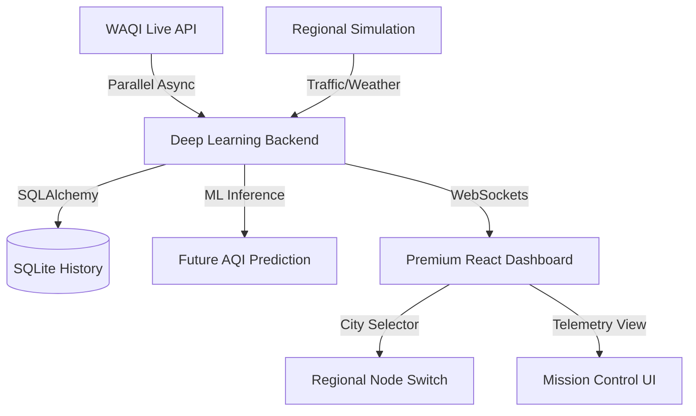

# 🏙️ Real-Time Smart City Analytics System

**A high-fidelity, data-driven mission control dashboard for urban environment monitoring and predictive air quality forecasting across 50+ Indian cities.**

---

[](https://github.com/Jignesh1021/Real-Time-Smart-City-Analytics-System)
[](https://fastapi.tiangolo.com/)
[](https://reactjs.org/)
[](https://scikit-learn.org/)

## 🚀 Key Features

*   **🌍 Multi-City Node Network**: Live telemetry from 50+ major Indian cities including Mumbai, Delhi, Bengaluru, and Chennai.
*   **📡 Real-Time API Injection**: Direct integration with the **World Air Quality Index (WAQI)** API for authentic environmental metrics.
*   **🤖 ML Predictive Engine**: A **Random Forest Regressor** trained to forecast future AQI levels based on live traffic and weather dynamics.
*   **🎨 Premium Stitch UI**: Glassmorphic "Mission Control" aesthetic built with React, Framer Motion, and Reacharts.
*   **⚡ Async Operations**: Non-blocking parallel data fetching ensuring a high-performance, low-latency data stream.
*   **🚦 Smart Directives**: Automated system alerts and sector-specific response suggestions based on regional pollution spikes.

## 🛠️ Tech Stack

### Backend
- **FastAPI**: High-performance Python framework for building the regional node APIs.
- **SQLAlchemy & SQLite**: Robust data persistence for historical telemetry and ML metadata.
- **Scikit-Learn**: Powering the predictive analytics and air quality forecasting.
- **Httpx & WebSockets**: Providing real-time, bi-directional data broadcasting.

### Frontend
- **React & Vite**: Modern reactive UI framework for the "Global Hub" dashboard.
- **TailwindCSS**: Custom glassmorphism and premium mission-control styling.
- **Framer Motion**: Smooth entry animations and responsive micro-interactions.
- **Recharts**: High-fidelity environmental trend visualization and data density charts.

## 🏗️ Architecture



## ⚙️ Installation & Setup

### 1. Backend Configuration
```bash
cd backend
# Create Virtual Environment
python -m venv venv
# Activate (Windows)
.\venv\Scripts\activate
# Install Dependencies
pip install -r requirements.txt
# Create .env file with your WAQI_TOKEN
echo WAQI_TOKEN=your_token_here > .env
# Launch Server
uvicorn main:app --reload
```

### 2. Frontend Launch
```bash
cd frontend
# Install Packages
npm install
# Start Development Server
npm run dev
```

## 🔐 Environment Security
The project includes a comprehensive [`.gitignore`](.gitignore) that protects:
*   `WAQI_TOKEN` (API Secrets)
*   Local database files (`*.db`)
*   Python virtual environments (`venv/`)
*   Node dependencies (`node_modules/`)

## 📄 License
This project is for educational and urban planning demonstration purposes.

---
**Smart City Analytics Protocol v2.5.0**  
*Built with precision for the next generation of urban monitoring.*